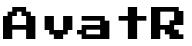

<a name="readme-top"></a>

<!-- PROJECT LOGO -->
<br />
<div align="center">

<div align="center">
  <a href="https://github.com/zanzarone/avatr">
    
  </a>
</div>
  
<div align="center">
  <a href="https://github.com/zanzarone/avatr">
    
  </a>
</div>

  <p align="center">
    A simple pixelart avatar generator  
    <br />
    <br />
    <a href="https://avatr.onrender.com/">View Demo</a>
    ·
    <a href="https://github.com/zanzarone/avatr/issues">Report Bug</a>
    ·
    <a href="https://github.com/zanzarone/avatr/issues">Request Feature</a>
  </p>
</div>

<div align="center">

<a href="https://it.linkedin.com/in/samuele-scatena"></a>
<a href="#license"></a>

</div>

<!-- ABOUT THE PROJECT -->

## About The Project

This project was born for fun, as an experiment in creating faces using pixel art

<!-- This project is the frontend part of <a href>Avatr API</a> -->

### Built With

- 
- 

<!-- GETTING STARTED -->

## Getting Started

### Prerequisites

- You must have `npm` installed on your machine in order to run the project.
  ```sh
  npm install npm@latest -g
  ```
- If you want to generate the `.png` you must also configure the backend service. Follow the instructions [here](https://github.com/zanzarone/avatr-api) to setup **AvatR API backend**.

### Installation

1. Clone the repo

   ```sh
   git clone https://github.com/zanzarone/avatr.git
   ```

2. Enter in the project directory
   ```sh
   cd avatr
   ```
3. Install NPM packages
   ```sh
   npm install
   ```
4. (**Optional**) Create an `.env` file in the root of the project and enter the local(or remote) address of the backend service
   ```js
   REACT_APP_API_ENDPOINT = "ENTER BACKEND ADDRESS";
   ```
5. Run the project
   ```sh
   npm start
   ```

<p align="right">(<a href="#readme-top">back to top</a>)</p>

<!-- ROADMAP -->

## Roadmap

- [ ] Add Additional pixelart Templates
- [ ] Add support for others file type

See the [open issues](https://github.com/othneildrew/Best-README-Template/issues) for a full list of proposed features (and known issues).

<p align="right">(<a href="#readme-top">back to top</a>)</p>

<!-- CONTRIBUTING -->

## Contributing

Contributions are what make the open source community such an amazing place to learn, inspire, and create. Any contributions you make are **greatly appreciated**.

If you have a suggestion that would make this better, please fork the repo and create a pull request. You can also simply open an issue with the tag "enhancement".
Don't forget to give the project a star! Thanks again!

1. Fork the Project
2. Create your Feature Branch (`git checkout -b feature/AmazingFeature`)
3. Commit your Changes (`git commit -m 'Add some AmazingFeature'`)
4. Push to the Branch (`git push origin feature/AmazingFeature`)
5. Open a Pull Request

<p align="right">(<a href="#readme-top">back to top</a>)</p>

<!-- LICENSE -->

<a name="license"></a>

## License

Distributed under the MIT License. See `LICENSE.txt` for more information.

<p align="right">(<a href="#readme-top">back to top</a>)</p>

<!-- CONTACT -->

## Contact

Samuele Scatena - [@LinkedIn](https://it.linkedin.com/in/samuele-scatena) - samuele.scatena@gmail.com

Project Link: [https://github.com/zanzarone/avatr](https://github.com/zanzarone/avatr)

<p align="right">(<a href="#readme-top">back to top</a>)</p>
